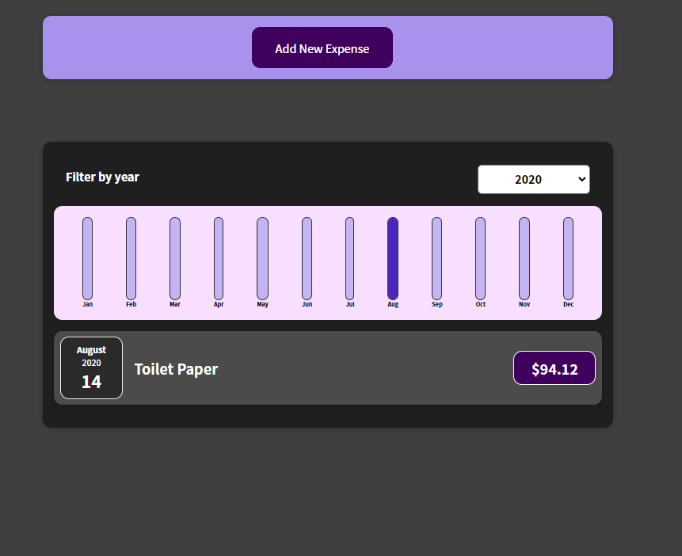
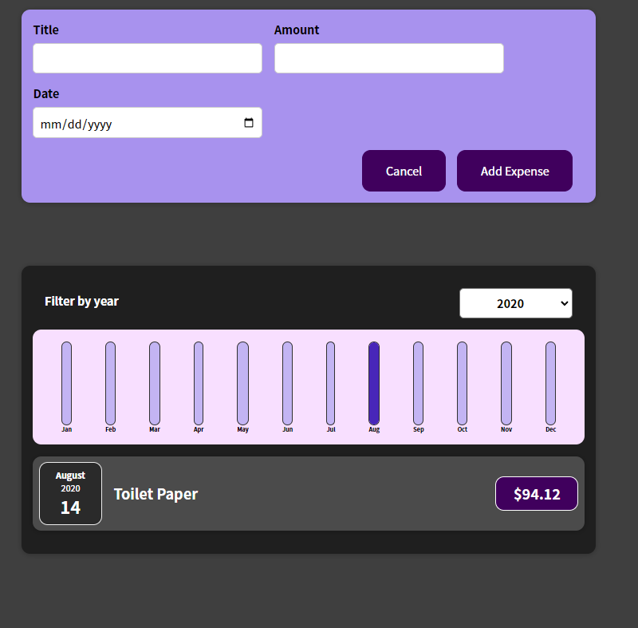
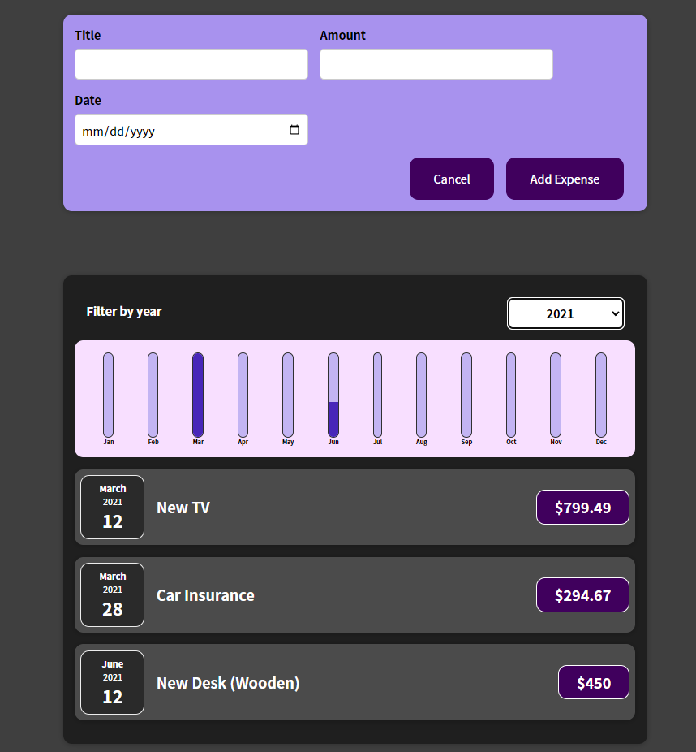

# Expense Tracker

  ## Description
  Using React I built an expense tracker.  You can add expenses and look at when you're most expensive spending times are each year.
  
  ## Table of Contents

  - [Tools](#tools)
  - [Screenshots](#screenshots)
  - [Questions](#questions)
  
  
  ## Tools
  
 React

  
  ## Screenshots
  [Live Portfolio](https://jsnyder159.github.io/expense-tracker/)

  ## Questions

  If you have any questions about the project please contact me at.
  - [GitHub](https://github.com/Jsnyder159?tab=repositories)
  - Email: jw.snyder159@gmail.com
